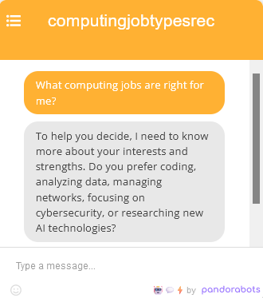

# CS Career Recommendation Chatbot

The CS Career Recommendation Chatbot is a sophisticated tool designed to guide computer science students nearing graduation through their career decision-making process. It leverages a conversational AI model to engage with students, asking relevant questions to understand their career preferences and strengths, and provides customized career guidance and resources.

## Table of Contents

- [Languages Used](#languages-used)
- [Technologies Used](#technologies-used)
- [Key Features](#key-features)
- [Training Cases](#training-cases)
- [Usage](#usage)
- [License](#license)

## Languages Used

- AIML: Artificial Intelligence Markup Language

## Technologies Used

- [Pandorabots](https://home.pandorabots.com/home.html)

## Key Features

- **Personalized Career Advice:** Offers career suggestions based on individual responses, aligning advice with the student's interests and strengths.
- **Diverse Career Options:** Explores various computing careers, including Software Developer, Data Scientist, Network Administrator, Cybersecurity Analyst, and AI Researcher.
- **Interactive Engagement:** Provides a conversational interface for a more natural and engaging user experience.

## Training Cases

The chatbot is trained on scenarios that mirror typical concerns among computer science students, aiding in targeted career guidance:

1. **Students Proficient in Coding but Uncertain of Career Path:** Aids students with strong technical skills in exploring suitable careers.
2. **Students Interested in Technology but Not in Math:** Guides students towards careers that are less reliant on advanced mathematical skills.

These cases enhance the chatbot's ability to deliver relevant advice tailored to different user profiles.

## Usage

To interact with the CS Career Recommendation Chatbot, follow these steps:

1. Navigate to [Pandorabots](https://www.pandorabots.com) through your browser and log in.
2. Visit the [bot directory](https://home.pandorabots.com/dash/bot-directory).
3. Use the search bar to find **"WJang CS Career Bot"**.
4. Click on the bot to open its message window in the bottom right corner.
5. Type "What computing jobs are right for me?" to initiate the conversation.
6. Press enter to send the message and begin interacting with the chatbot.

## License

[MIT License](LICENSE)
